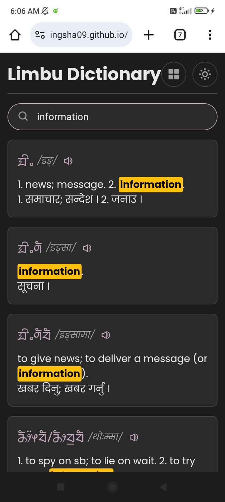

# Limbu-Dictionary



A modern, web-based **Limbu Dictionary** displaying Limbu words, meanings, and translations (Nepali/English). Users can search, browse by letter, and listen to word pronunciations. This project also provides a **public API** to fetch the dictionary data, allowing others to build their own apps or dictionaries using the same dataset.

---

## 🔗 Live Demo

You can view the live dictionary here: https://ingsha09.github.io/Limbu-Dictionary/

---

## 📦 Features

-   Full Limbu dictionary with English and Nepali meanings.
-   Search by Limbu, English, or Nepali text.
-   Browse by Limbu letters (index view).
-   Lazy-loading for performance on large datasets.
-   Dark mode toggle.
-   Text-to-Speech (TTS) for Nepali/English meanings.
-   Fully responsive design.

---

The dictionary data is publicly accessible through a JSON API, allowing developers to integrate this valuable lexical resource into their own applications.

---

## How to Use the API and Fetch Data


You can access the entire Limbu dictionary dataset through a single API endpoint. The data is provided in a straightforward JSON format, making it easy to parse and use in any programming language.

**API Endpoint**

The public URL for the dictionary's JSON data is:

```
https://cdn.jsdelivr.net/gh/ingsha09/limbu-dictionary-data@refs/heads/main/data.json
```

**Data Structure**

The JSON data is structured as an object where each key is a Limbu word. The value associated with each key is an object containing detailed information about that word.


Here is a sample of the JSON structure:

```
{
  "ᤀᤁ": {
    "dId": "ᤀᤁ",
    "desc": "Example word",
    "mean": "Meaning in Nepali or English",
    "group": "Optional group/category"
  },
  "ᤂᤃ": {
    "dId": "ᤂᤃ",
    "desc": "Another word",
    "mean": "Meaning text",
    "group": ""
  }
}
```

-   *dId:* The Limbu word itself.
-   *desc:* An optional description or additional information about the word.
-   *mean:* The meaning of the word, typically in Nepali and/or English.
-   *group:* An optional category or grouping for the word.

**Fetching Data with JavaScript**

You can easily *fetch* and use this data in a web application using the fetch API in JavaScript. The following example demonstrates how to retrieve the dictionary data and log it to the console.

```
// API endpoint for the Limbu dictionary data
const API_URL = 'https://cdn.jsdelivr.net/gh/ingsha09/limbu-dictionary-data@refs/heads/main/data.json';

// Function to fetch and process the dictionary data
async function getLimbuDictionary() {
  try {
    // Fetch the data from the API
    const response = await fetch(API_URL);

    // Check if the request was successful
    if (!response.ok) {
      throw new Error(`HTTP error! status: ${response.status}`);
    }

    // Parse the JSON response
    const data = await response.json();

    // Log the entire dictionary object
    console.log(data);

    // You can now use the 'data' object in your application
    // For example, to access the meaning of a specific word:
    const word = 'ᤀᤁ';
    if (data[word]) {
      console.log(`The meaning of ${word} is: ${data[word].mean}`);
    }

  } catch (error) {
    console.error('Error fetching the dictionary data:', error);
  }
}

// Call the function to fetch the data
getLimbuDictionary();
```
