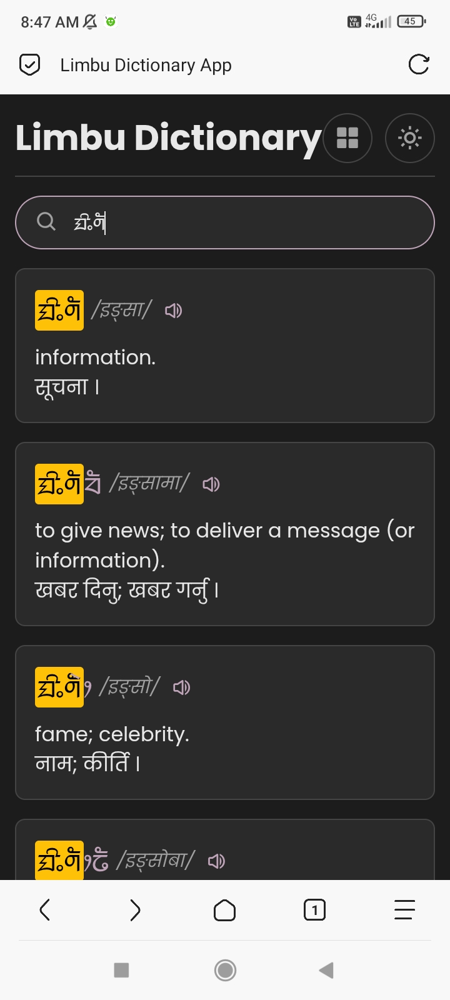

# Limbu-Dictionary



A modern, web-based **Limbu Dictionary** displaying Limbu words, meanings, and translations (Nepali/English). Users can search, browse by letter, and listen to word pronunciations. This project also provides a **public API** to fetch the dictionary data, allowing others to build their own apps or dictionaries using the same dataset.

---

## 🔗 Live Demo

You can view the live dictionary here:  
👉 https://ingsha09.github.io/Limbu-Dictionary/

---

## 📦 Features

- Full Limbu dictionary with English and Nepali meanings.  
- Search by Limbu, English, or Nepali text.  
- Browse by Limbu letters (index view).  
- Lazy-loading for performance on large datasets.  
- Dark mode toggle.  
- Text-to-Speech (TTS) for Nepali/English meanings.  
- Fully responsive design.  

---

## 🌍 Public API

The dictionary data is publicly accessible through a JSON API, allowing developers to integrate this valuable lexical resource into their own applications.

---

## 📡 How to Use the API and Fetch Data

You can access the entire Limbu dictionary dataset through a single API endpoint. The data is provided in a straightforward JSON format, making it easy to parse and use in any programming language.

### API Endpoint

https://cdn.jsdelivr.net/gh/ingsha09/limbu-dictionary-data@main/data.json

### 🔄 Cache-Busting (Always Get Latest Data)

Since jsDelivr caches files, sometimes updates may not appear immediately. To bypass cache and always fetch the latest version, append a **timestamp query parameter**:

https://cdn.jsdelivr.net/gh/ingsha09/limbu-dictionary-data@main/data.json?t=12345

Or in JavaScript, use `Date.now()` to auto-refresh:

```js
const API_URL = 'https://cdn.jsdelivr.net/gh/ingsha09/limbu-dictionary-data@main/data.json?t=' + Date.now();
```
---


## 📂 Data Structure

The JSON data is structured as an object where each key is a Limbu word.

Each entry looks like this:

```
{
  "ᤀᤁ": {
    "dId": "ᤀᤁ",
    "desc": "Example word",
    "mean": "Meaning in Nepali or English",
    "group": "Optional group/category"
  },
  "ᤂᤃ": {
    "dId": "ᤂᤃ",
    "desc": "Another word",
    "mean": "Meaning text",
    "group": ""
  }
}
```

-   **dId** → The Limbu word itself.
-   **desc** → Optional description or explanation.
-   **mean** → Meaning in Nepali/English.
-   **group** → Optional category/grouping.

---

## ⚡ Fetching Data with JavaScript

Here’s how you can use the dictionary API in your own projects:

```
// API endpoint for the Limbu dictionary data (with cache-busting)
const API_URL = 'https://cdn.jsdelivr.net/gh/ingsha09/limbu-dictionary-data@main/data.json?t=' + Date.now();

// Function to fetch and process the dictionary data
async function getLimbuDictionary() {
  try {
    // Fetch the data from the API
    const response = await fetch(API_URL);

    // Check if the request was successful
    if (!response.ok) {
      throw new Error(`HTTP error! status: ${response.status}`);
    }

    // Parse the JSON response
    const data = await response.json();

    // Log the entire dictionary object
    console.log(data);

    // Example: access the meaning of a specific word
    const word = 'ᤀᤁ';
    if (data[word]) {
      console.log(`The meaning of ${word} is: ${data[word].mean}`);
    }

  } catch (error) {
    console.error('Error fetching the dictionary data:', error);
  }
}

// Call the function to fetch the data
getLimbuDictionary();
```

---

## 🤝 Contributing

If you’d like to contribute:

1. Fork this repo.
2. Edit or add new words in the data repo: https://github.com/ingsha09/limbu-dictionary-data
3. Submit a pull request.
